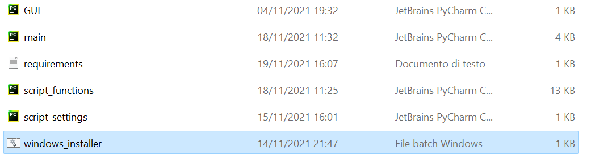
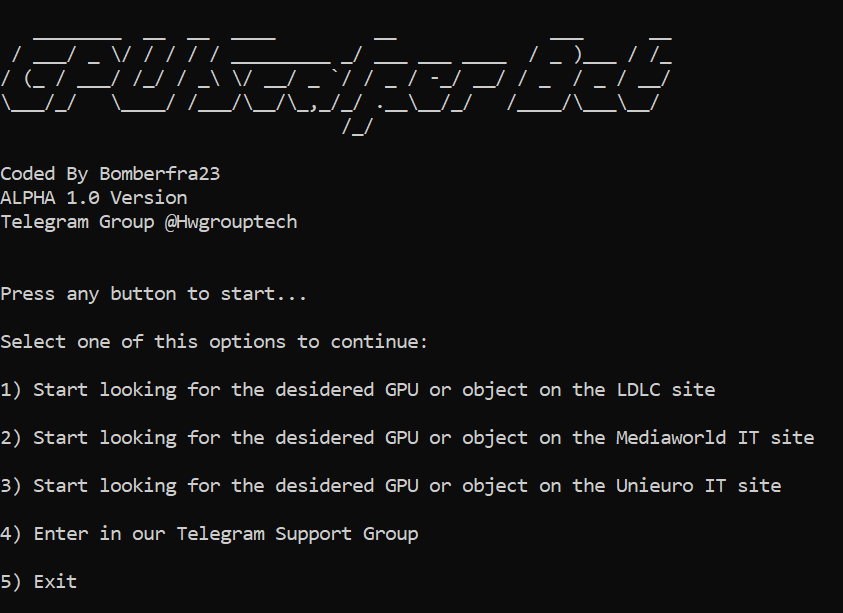
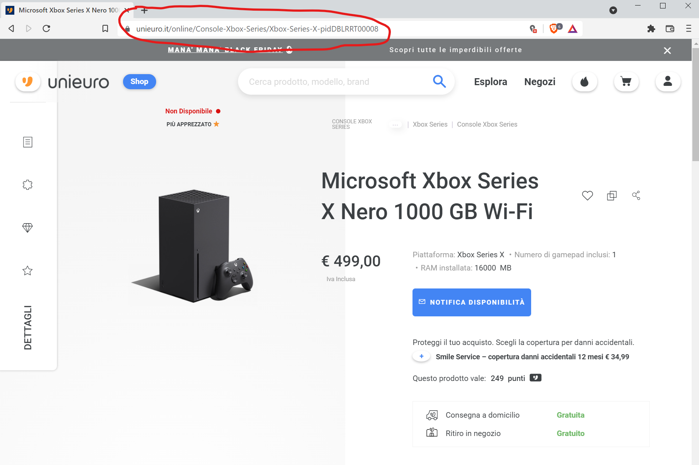

Please star my repo if helped you! Thanks!

Please Join [Support & FAQ Telegram Group](https://t.me/HwGroupTech) if you have any questions about this software.

# FREE Add-To-Cart Bot for upon 10 stores GPU/PS5/Xbox

## Description
GPU Scalper Bot Alpha, is an automatic add to cart, remote alert and check product availability completely free Bot. It can scrape various gpu and informatic stores, check if a product is available or not, add to cart it automatically and send you a status notification via Telegram Bot. It works on Chrome and on every device that has Python installed so Windows 7/8/10/11, MacOS, Linux Distro.

## Chrome Browser Configuration
In order to work, this bot must collaborate with Chrome WebDriver that is an open source tool for automated testing of webapps across Google Chrome Browser.
#### Download Chrome Webdriver

1. Download it at this [link](https://chromedriver.chromium.org/downloads)
2. Place it in a directory (example, C:\Program Files (x86)\chromedriver.exe)
3. Enter the path in the <b>script_settings</b> file in <b>Chromedriver_path</b>
## Get Started with the bot
Now we are ready to start the script, let's see how to do it
#### requirements

1. Python 3.6 or superior installed on your MacOS, Windows or Linux machine
2. Python PIP installed
3. (optional) an IDE like PyCharm for modify Py files
#### Bot Files

This Pyhton Software is composed by 6 files:

1. <b>main.Py</b> which is the main file to run to get evrything started
2. <b>GUI.Py</b> which is the file responsible for the graphical interface
3. <b>script_functions.Py</b> which is the "engine" file of the software
4. <b>script_settings.Py</b> which is the file that we have to modify for change settings like alert filters ecc
5. <b>requirements.txt</b> which is a TXT file that tells automatically to Python PIP what packages install (Windows, Linux, MacOS)
6. <b>Windows_Installer.Bat</b> which is a BAT file that install automatically all the requirements of the bot if you run it (only Windows)

#### install packages
Windows, Linux, MacOS
1. after installing Python PIP on your machine, open Terminal or CMD
2. with the cd command, enter on the GPU Scalper Bot folder
3. write the command as below to install all the packages

Only Windows

1. simply open the GPU Scalper Bot folder and double click on the BAT file

#### run main file and the home

1. run the <b>main.Py</b> file as shown to start the software 

This is the main home of the bot where you can choose which shop to point to, visit our Telegram Group or Exit!

#### change settings

When your first open the <b>script_settings.Py</b> file, you find this four entries

1) <b>Chromedriver_path</b> where you have to insert the location of the <b>chromedriver.exe</b> file
2) <b>telegram_bot_token</b> where you have to insert you telegram bot Token after have create it with [BotFather](https://t.me/botfather)
3) <b>telegram_chat_id</b> where you have to insert your personal Telegram chat id that you can take from [here](https://t.me/chatIDrobot)
4) <b>telegram_alert_status</b> that enable or disable the Telegram Alert Notifications entering True or False

## start buy anything!

After selecting one of the three stores available on this version you have to insert an handful of temporal values to start making the bot work, let's see.

### link

The bot has to known of what product you are interested in, you can simply tell to it by inserting the product link by pasting it.

### requests delay

After have correctly inserted the product link, the bot has to known how many time has to past beetween requests to the website page

You must insert an integral number value greater than 0 or equal to 0

### threads

This Bot has also a multi-threading requests implementation that provides a really huge boost to all the process.

You can simply tell to the bot how many threads do you want to run inserting a integral number value greater than 1 or equal to 1 (DO NOT EXCEED 16 THREADS OR YOUR COMPUTER MAY CRASHS!)

### Availability check

after have started the bot, it will constantly check if the desidered product is available so you will see a screen similar to this one:

### Telegram Alert

If you have configured all properly, when the Bot successfully add to cart the desidered product you will receive a message from your Telegram Bot like this:

However, if the bot has a problem adding to the cart like no responding site ecc... you will see a message like this:

## END

Thanks for have entirely read this guide, now you are ready to buy all of the GPUs you need!
Stay updated for the coming release and leave a STAR
